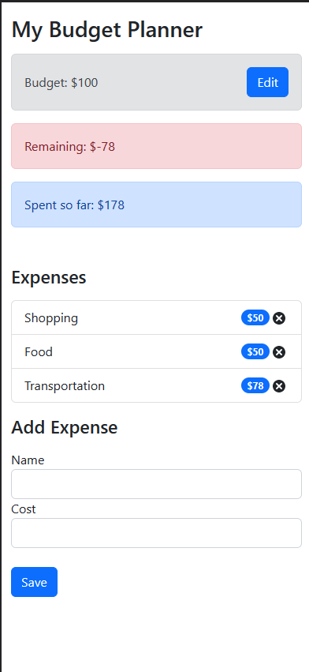

# Budget Tracker App

The Budget Tracker App is a simple application designed to help you manage your expenses and track your budget effectively. This document provides a brief overview of the app's features and functionality.

## Features

- **Set a Budget**: Start by setting your budget for a specific period, such as a month or a week. This will serve as the target amount you aim to spend within the defined timeframe.

- **Expense Tracking**: Easily add expenses to the app, specifying the amount spent and a brief description of the expense. The app will automatically calculate the remaining budget and the total amount spent so far.

- **Real-time Updates**: As you add expenses, the app will instantly update the remaining budget and the total amount spent, allowing you to monitor your spending in real-time.

## Usage

To get started with the Budget Tracker App, follow these steps:

1. **Setting a Budget**: Launch the app and navigate to the "Set Budget" section. Enter the desired budget amount for the specified period and click "Save."

2. **Adding Expenses**: Move to the "Expenses" section and click on the "Add Expense" button. Enter the amount spent and provide a brief description of the expense. Click "Save" to record the expense.

3. **Tracking Expenses**: After adding an expense, the app will automatically update the remaining budget and the total amount spent. These values will be displayed prominently on the app's main screen, allowing you to keep track of your spending progress.

## Example

For instance, suppose you set a budget of $500 for the month of June. As you add expenses throughout the month, the app will deduct the respective amounts from the remaining budget and show you the updated value. If you spend $50 on groceries, the remaining budget will decrease to $450, and the total amount spent will be $50.

By using the Budget Tracker App, you can gain a better understanding of your spending habits and make informed financial decisions to stay within your budget.

## Conclusion

The Budget Tracker App provides a user-friendly solution for managing your expenses and tracking your budget. With its simple interface and real-time updates, you can effortlessly monitor your spending and ensure you stay on track with your financial goals.

Feel free to customize this summary to fit your specific app and its features.

## Snapshots

